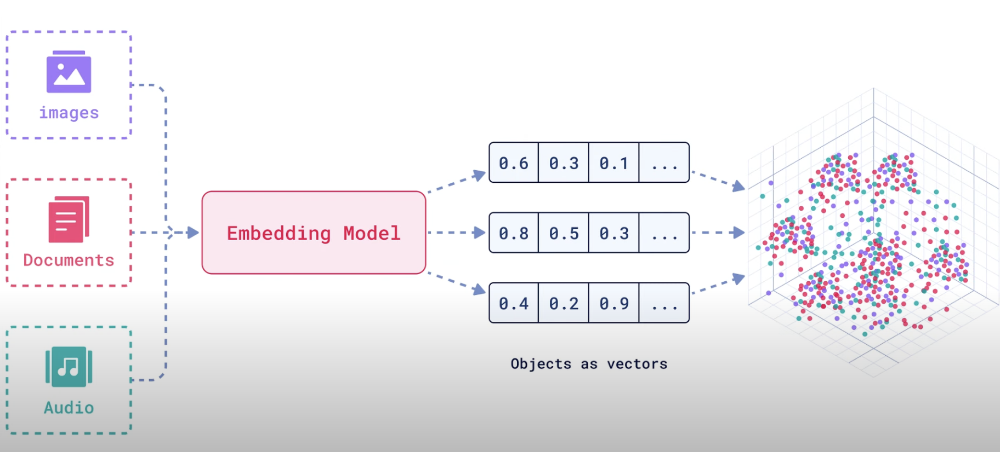

# Retrieval Augmented Generation (RAG): 
How to bring external knowledge into LLMs so that it can be able to answer user questions with more information oon what it was trained on. 

## How it works: 
For every document that we want to be a part of the knowledge, we split it into chunks and then turned into vectors that are stored as embeddings in the vector database.

We can use whole sign similarities or other mathematical functions to determine how one text is similar to another. How similar a user text is to a specific chunk of text in the document. 

User will ask a question, and the same embedding function used to create the document chunk will be used to create a vector for the user question. We'll then put it into the vector db and match it with the most relevant knowledge that has the most similar vector to the user question. 

We'll then return the top case similar chunk, then generate the answers with the documents as context.

